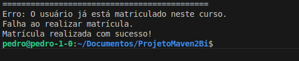
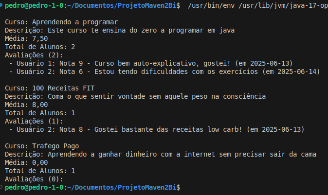
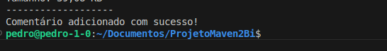
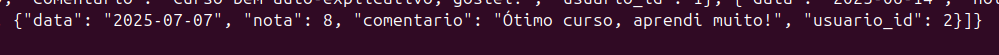
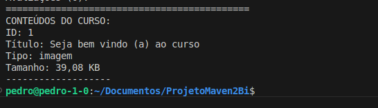

<h1> VISÃO GERAL DO SISTEMA </h1>

O sistema é uma aplicação Java para gestão de cursos online, com persistência em PostgreSQL, seguindo o padrão DAO (Data Access Object) para separar a lógica de negócios do acesso a dados.
+++
<h1> FUNCIONALIDADES </h1>

* Cadastrar usuário
* Obter ID de usuário
* Matricular em curso
* Listar cursos com detalhes
* Adicionar comentário (JSON)
* Buscar conteudo de curso

Aplicação feita com banco de dados PostgreSQL e desenvolvida em Java com JDBC (Maven).
---
<h1> REQUISITOS E DEPENDÊNCIAS </h1>
*O projeto utiliza as seguintes dependências principais, gerenciadas pelo Maven:*

* PostgreSQL JDBC MAVEN: Para garantir uma conexão segura com o banco PostgreSQL, suporte a prepared statements, manipulação de tipos JSON/JSONB e operações com grandes objetos (binários).
* JSON.org: Processar avaliações em JSONB, serialização/deserialização de comentários e manipulação de estruturas de dados complexas.

*Configuração do Ambiente:*
* Java JDK: 17+ (configurado no POM).
* Maven: 3.6.0+
* PostgreSQL: 13+
* Driver JDBC PostgreSQL (configurado via pom.xml).
* IDE recomendada: VSCode, IntelliJ IDEA (com plugin Maven).

*Instalação das Dependências do Maven*
`mvn clean install` -> No terminal

---

<h1> ESTRUTURA E FUNCIONAMENTO DO PROJETO </h1>
### Camadas Principais
1. Camada de Modelos (negócio):
__Classes:__
* Conteudo.java: Modela conteúdos educacionais (vídeos, PDFs, imagens).
* Curso.java: Representa cursos oferecidos na plataforma.
* Matricula.java: Gerencia a relação entre usuários e cursos.
* Usuário.java: Modela os usuários do sistema.
__Características:__
* Contém apenas atributos e lógica básica de negócio.
* Focadas em estrutura de dados.
* Relacionamentos refletem a estrutura do banco de dados.

2. Camada de Persistência (DAO)
__Classes:__
* ConexaoPostgreSQL.java: Gerencia conexões com o banco.
* ConteudoDAO.java: Operações com conteúdos.
* CursoDAO.java: Gestão de cursos e avaliações JSON.
* MatriculaDAO.java: Controle de matrículas.
* UsuarioDAO.java: Operações com usuários.
__Padrões utilizados:__
* JDBC para acesso a dados.
* Prepared Statements para segurança.

3. Camada de Apresentação
__Classe principal:__
* Main.java: Classe de entrada do sistema.
__Responsabilidades:__
* Demonstrar funcionalidades do sistema.
* Testar integração entre camadas.
* Simular fluxos de uso.

### Exemplo de Funcionamento
__Caso 1: Adicionar comentário a curso__
1. `Main.java` cria objeto com dados do comentário
2. Chama `CursoDAO.adicionarComentario()`
3. DAO valida existência do curso e usuário
4. Atualiza JSONB no banco
5. Retorna status para camada de apresentação

__Caso 2: Listar conteúdos do curso__
1. `Main.java` solicita conteúdos por curso ID
2. `ConteudoDAO.buscarConteudosPorCurso()` executa query
3. Transforma ResultSet em objetos `Conteudo` 
4. Retorna lista para apresentação

## Benefícios da Estrutura
1. __Separação de preocupações:__ Cada camada tem responsabilidade única.
2. __Facilidade de manutenção:__ Modificações isoladas por camada.
3. __Escalabilidade:__ Possibilidade de substituir componentes (ex: JPA no lugar de JDBC)

---

<h1> CLASSES DA CAMADA DE PERSISTENCIA </h1>
<h3> ConexaoPostgreSQL </h3>

Classe responsável por gerenciar a conexão com o banco de dados PostgreSQL.

### Funcionamento
1. Configura os parâmetros de conexão no construtor:
 * Host
 * Porta
 * Usuário
 * Senha
 * Banco
 
2. Método `getConnection()`:
 * Monta a URL de conexão no formato `jdbc:postgresql://host:port/database`
 * Usa `DriverManager.getConnection()` para estabelecer a conexão
 * Lança SQLException em caso de falha
 
<h3> usuarioDAO: </h3>

### Método Inserir
| Funcionamento                      | Detalhes                                  |
|------------------------------------|-------------------------------------------|
| Estabelece conexão com o banco     | Abre conexão com PostgreSQL              |
| Prepara statement SQL              | Usa parâmetros para evitar SQL injection |
| Executa a inserção                 | Recupera ID gerado                       |
| Atualiza o objeto usuário          | Define o ID gerado pelo banco            |

### Método Obter
| Funcionamento                     | Detalhes                                  |
|------------------------------------|-------------------------------------------|
| Estabelece conexão com o banco     | Abre conexão com PostgreSQL              |
| Busca usuário por ID               | Usa SELECT com WHERE id=?                |
| Retorna objeto Usuario             | Popula todos os campos se encontrado     |
| Retorna objeto vazio               | Se nenhum usuário for encontrado         |

<h3> matriculaDAO: </h3>

### Método inserirMatricula
| Validação                         | Método auxiliar          |
|------------------------------------|--------------------------|
| Verifica se matrícula já existe    | matriculaJaExiste()      |
| Verifica se usuário existe         | usuarioExiste()          |
| Verifica se curso existe           | cursoExiste()            |

**Como é feita a verificação**:  
Todos os métodos auxiliares utilizam `SELECT COUNT(*)` e retornam `true` indicando existência.

**Fluxo principal**:
* Se todas validações passarem, executa inserção
* Recupera ID gerado
* Atualiza objeto matricula

   
*Tentando matricular usuário já matriculado e um não matriculado*

<h3> cursoDAO: </h3>

### Métodos Principais
| listarCursosComDetalhes             | adicionarComentario               |
|-------------------------------------|------------------------------------|
| Calcula média de avaliações (JSONB) | Valida nota e comentário          |
| Conta alunos matriculados           | Verifica existência de usuário e curso|
| Agrupa resultados por curso         | Atualiza JSONB com novo comentário|

**Observação**:  
Reutiliza os mesmos métodos de verificação (usuarioExiste, cursoExiste) que MatriculaDAO.

 
*Cursos com avaliações JSON, total de aluno, notas e médias*

  
*Adicionando comentário: Saída no terminal do VS Code*

  
*Comentário adicionado: Visualização direta no banco de dados*

<h3> conteudoDAO: </h3>

### Responsabilidades
- Gerencia conteúdos dos cursos (vídeos, PDFs, etc)
- Fornece informações sobre tamanho e tipo de arquivos

### Método buscarConteudosPorCurso
| Funcionalidade                     | Detalhes                                  |
|------------------------------------|-------------------------------------------|
| Retorna lista de conteúdos         | Inclui todos os metadados                |
| Calcula tamanho do arquivo         | Usa LENGTH(arquivo)                      |
| Não carrega binários por padrão    | Apenas metadados são retornados          |

**Conversão de tamanho**:  
O método `getTamanhoFormatado()` converte bytes para KB/MB e é usado no `toString()`.

  
*Exemplo de retorno de conteúdos*

--- 

### Padrões comuns
1. *Conexões:* Todas as DAOs usam  `ConexaoPostgreSQL`
2. *Tratamento de recursos:* Usam try-with-resources
3. *Validações:* Verificam a existência de entidades relacionadas
4. *Segurança:* Usam PreparedStatement para evitar SQL injection
